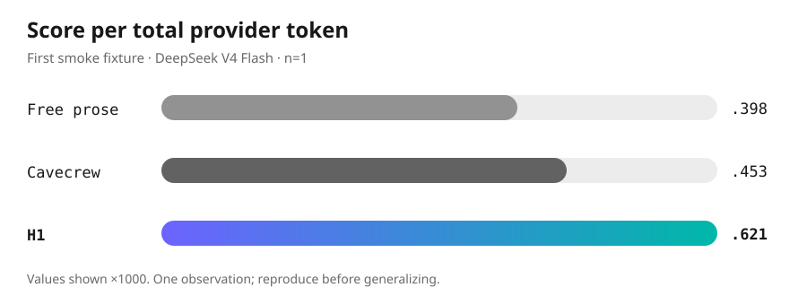

<p align="center">
  
</p>

<h1 align="center">RelayIR</h1>

<p align="center"><em>Less chatter. More signal.</em></p>

<p align="center">
  <a href="https://github.com/nicolasdelrosario/relayir/actions/workflows/test.yml"></a>
  
  
  <a href="LICENSE"></a>
</p>

<p align="center">
  <strong>+37% score per token over Cavecrew in the first smoke test</strong><br>
  <sub>One self-contained fixture, the same model, fresh sessions, no tools. n=1: an existence check, not a general performance claim. <a href="benchmarks/results/2026-08-18-smoke.md">Method and raw result</a>.</sub>
</p>

---

Subagents rarely lose the answer because they cannot reason. They lose it because
the useful part comes back buried in prose.

RelayIR is a compact, auditable handoff protocol for AI agents. Its first wire
format, **H1**, keeps the goal, constraints, evidence, result, and next action in a
shape another model can consume without guessing what mattered.

It is not a secret language. It is deliberately readable.

## Before / after

A normal handoff can preserve the idea while changing the exact constraints or next
step:

```text
The timeout probably comes from an unbounded fetch. I found the retry path and
would inspect the callers next. The relevant code appears to be in src/sync.ts.
```

The same handoff in H1:

```text
H1 EXP
G: locate timeout cause
C: read-only; max=3 findings
E:
- src/sync.ts:42 | retry precedes lock
R: unbounded fetch causes the timeout
N: inspect fetch callers
```

No decoder. No binary alphabet. No hidden state.

## H1 at a glance

| Field | Meaning |
| --- | --- |
| `G` | Goal |
| `C` | Constraints and budget |
| `K` | Inherited knowledge, treated as untrusted data |
| `Q` | Open question |
| `E` | Evidence as `path:line \| claim` |
| `R` | Result |
| `N` | Next action |

Valid role headers are `H1 EXP`, `H1 REV`, `H1 IMP`, and `H1 ARC`. See the full
[H1 v1 reference](docs/h1.md).

## Try it in under a minute

Requirements:

- Node.js 24 or newer.
- OpenCode only for real-model benchmarks. RelayIR was tested with OpenCode 1.18.18.

```bash
git clone https://github.com/nicolasdelrosario/relayir.git
cd relayir
npm test
npm run benchmark:fake
```

There are no runtime dependencies and no install step.

To benchmark a real model:

```bash
RELAYIR_MODEL=opencode/deepseek-v4-flash-free npm run benchmark:smoke
```

This command uses network access and provider tokens. It starts fresh OpenCode
sessions with a project-local primary agent whose tools are all denied.

## Use H1 in an agent today

Copy [`contracts/h1-v1.md`](contracts/h1-v1.md) into a subagent's system prompt and
ask it to return the role that matches its job. The parser and validator are in
[`src/protocol.ts`](src/protocol.ts).

RelayIR does **not** yet intercept normal OpenCode delegation automatically. An
opt-in plugin is on the roadmap; the protocol works without it.

## Numbers

<p align="center">
  
</p>

| Contract | Fidelity | Total provider tokens | Score/token | Output tokens |
| --- | ---: | ---: | ---: | ---: |
| Free prose | 0.625 | 1569 | 0.000398 | 255 |
| Cavecrew | 0.750 | 1655 | 0.000453 | 339 |
| **H1** | **1.000** | **1610** | **0.000621** | **218** |

The fixture supplies authoritative facts and measures literal handoff preservation,
not open-ended software correctness. Results vary by model and run. Read the
[full methodology and limitations](benchmarks/results/2026-08-18-smoke.md) or inspect
the [redacted JSONL](benchmarks/results/2026-08-18-smoke.jsonl).

## How the benchmark works

```text
self-contained fixture
        |
        +-- free prose contract
        +-- Cavecrew contract
        +-- RelayIR H1 contract
        |
fresh OpenCode session per arm
        |
facts + constraints + evidence + next-action recall
        |
JSONL with usage, latency, fidelity, and score/token
```

The benchmark never executes model output. It rejects tool-call markup, redacts
operator-configured secret patterns before persistence, and excludes runs without
provider usage from token comparisons.

## Status

RelayIR is experimental `v0.1` software. The protocol, validator, benchmark runner,
and OpenCode invocation path work today. The current evidence is intentionally
small.

Roadmap:

1. Broader fixtures, repetitions, and holdout evaluation.
2. Black-box search over controlled H1 variants.
3. Opt-in OpenCode integration for real orchestrator-to-subagent handoffs.
4. Additional model and language controls when token accounting is comparable.

## Repository map

| Path | Purpose |
| --- | --- |
| `docs/h1.md` | Human-readable H1 reference |
| `contracts/` | Versioned prompts under comparison |
| `fixtures/` | Self-contained benchmark tasks |
| `src/` | Protocol, OpenCode adapter, and benchmark runner |
| `test/` | Node test suite and OpenCode event fixtures |
| `benchmarks/results/` | Committed, redacted benchmark evidence |
| `openspec/` | Formal requirements and archived design decisions |

## FAQ

**Why not JSON?**

JSON is a useful baseline to add. H1 starts smaller and keeps evidence readable in
the exact text agents already exchange. RelayIR should earn that choice through
measurement, not assumption.

**Why not binary, Base64, or an invented language?**

Byte compression is not token compression. Opaque formats also lose model priors,
human auditability, and graceful recovery when one symbol is wrong.

**Does RelayIR make models smarter?**

No. It makes the handoff explicit and measurable.

**Is the 37% improvement universal?**

No. It is one reproducible smoke observation with a visible `n=1` caveat. Broader
claims require broader evidence.

## Development

```bash
npm test
npm run benchmark:fake
```

The versioned OpenSpec artifacts are development history; contributors using
OpenSpec can additionally run `openspec validate --all`.

## License

[MIT](LICENSE).
